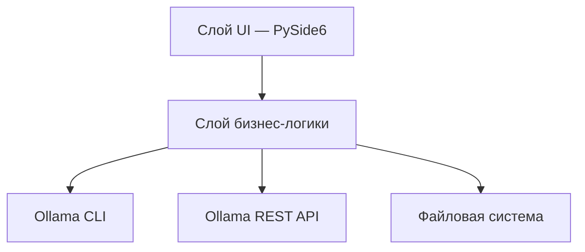

# Техническое задание: Ollama Model Manager

**Версия документа:** 1.0  
**Дата:** 17.06.2025  
**Платформа:** Windows 11  
**Рабочее название проекта:** Ollama Model Manager (рабочее имя, может быть изменено)

---

## 1. Общие сведения

### 1.1. Назначение системы

Десктопное приложение для управления LLM-моделями в экосистеме [Ollama](https://docs.ollama.com/quickstart) на локальном ПК под управлением Windows 11. Программа предоставляет единый графический интерфейс для:

- просмотра установленных (зарегистрированных в Ollama) моделей;
- запуска моделей с доступом по HTTP API в локальной сети и на том же ПК;
- импорта моделей из каталогов Safetensors (Hugging Face) в Ollama;
- экспорта моделей Ollama для переноса на другой ПК;
- удаления моделей из списка Ollama;
- тестирования работы запущенных моделей через встроенный чат.

### 1.2. Начальные условия (предпосылки)

На целевом ПК должны быть выполнены следующие условия:

| № | Условие | Примечание |
|---|---------|------------|
| 1 | Установлен Ollama | [Документация Quickstart](https://docs.ollama.com/quickstart) |
| 2 | ОС — Windows 11 | Минимальная целевая платформа |
| 3 | В отдельном каталоге скачаны дистрибутивы моделей с Hugging Face в формате **Safetensors** | Каталог задаётся пользователем при импорте |
| 4 | Скачанные модели Ollama расположены в каталоге, подключённом к Ollama | Через переменную окружения `OLLAMA_MODELS` или стандартный путь `%USERPROFILE%\.ollama\models` |
| 5 | Ollama API доступен по адресу `http://localhost:11434` | Стандартный порт Ollama на Windows |

### 1.3. Целевая аудитория

Пользователи, работающие с локальными LLM-моделями: разработчики, системные администраторы, энтузиасты self-hosted AI. Уровень технической подготовки — от базового (знание путей к каталогам) до продвинутого (настройка параметров Modelfile).

---

## 2. Технологический стек и сборка

### 2.1. Стек разработки

| Компонент | Технология | Версия (рекомендуемая) |
|-----------|------------|------------------------|
| Язык | Python | 3.11+ |
| GUI-фреймворк | PySide6 (Qt for Python) | 6.6+ |
| HTTP-клиент | `httpx` или `requests` | Актуальная стабильная |
| Асинхронность / фоновые задачи | `QThread`, `QRunnable` + сигналы Qt | — |
| Сериализация настроек | JSON / QSettings | — |
| Упаковка | PyInstaller | 6.x |

### 2.2. Сборка в один EXE-файл

- В корне проекта размещается **BAT-файл** `build.bat` (или `build_release.bat`), выполняющий:
  1. создание/активацию виртуального окружения (опционально);
  2. установку зависимостей из `requirements.txt`;
  3. запуск PyInstaller с параметрами `--onefile` (один исполняемый файл);
  4. размещение результата в каталог **`build/`** со всеми необходимыми зависимостями и ресурсами (иконки, QSS-стили, локализация).
- Итоговая структура каталога `build/`:

```
build/
├── OllamaModelManager.exe    # основной исполняемый файл
├── README_build.txt          # краткая инструкция по запуску
└── (при необходимости) дополнительные ресурсы PyInstaller
```

- BAT-файл должен завершаться с понятным сообщением об успехе/ошибке.
- Сборка должна выполняться **на Windows 11** без ручной донастройки после клонирования репозитория (кроме установки Python).

### 2.3. Зависимости от внешних компонентов

- **Ollama CLI** (`ollama`) должен быть доступен в `PATH` системы.
- **Ollama-сервис** должен быть запущен (фоновое приложение в трее Windows или `ollama serve`).
- Приложение **не устанавливает** Ollama — только взаимодействует с ним.

---

## 3. Архитектура приложения

### 3.1. Рекомендуемая структура проекта

```
ollama_model_manager/
├── main.py                     # точка входа
├── ui/
│   ├── main_window.py          # главное окно
│   ├── model_list_widget.py    # список моделей
│   ├── model_details_panel.py  # панель характеристик
│   ├── import_dialog.py        # мастер импорта
│   ├── export_dialog.py        # мастер экспорта
│   ├── progress_dialog.py      # окно хода выполнения
│   ├── chat_widget.py          # тестовый чат
│   └── settings_dialog.py      # настройки
├── core/
│   ├── ollama_client.py        # обёртка над CLI и REST API
│   ├── model_service.py        # бизнес-логика моделей
│   ├── import_service.py       # логика импорта Safetensors / Ollama
│   ├── export_service.py       # логика экспорта
│   └── config.py               # конфигурация приложения
├── resources/
│   ├── styles/
│   │   └── app.qss             # стили интерфейса
│   └── icons/                  # иконки
├── requirements.txt
├── build.bat
└── TZ_servers_ollama.md
```

### 3.2. Слои приложения



### 3.3. Способы взаимодействия с Ollama

| Операция | Предпочтительный способ | Команда / Endpoint |
|----------|--------------------------|-------------------|
| Список моделей | REST API | `GET /api/tags` |
| Детали модели | REST API / CLI | `GET /api/show`, `ollama show <model>` |
| Запущенные модели | REST API | `GET /api/ps` |
| Удаление модели | REST API / CLI | `DELETE /api/delete`, `ollama rm <model>` |
| Создание модели (импорт) | CLI + Modelfile | `ollama create <name> -f Modelfile` |
| Экспорт (копирование blobs) | Файловая система + Modelfile | Копирование из каталога моделей Ollama |
| Запуск модели в памяти | REST API | `POST /api/generate` или `POST /api/chat` |
| Остановка модели | CLI | `ollama stop <model>` |

---

## 4. Функциональные требования

### 4.1. Главное окно — список моделей

#### 4.1.1. Отображение списка

- При запуске и по кнопке «Обновить» приложение получает перечень моделей, зарегистрированных в Ollama (`ollama list` / `GET /api/tags`).
- Для каждой модели в списке отображаются:
  - **имя модели** (например, `llama3.2:latest`);
  - **размер** на диске (в ГБ/МБ, человекочитаемый формат);
  - **дата изменения** (`modified_at`);
  - **семейство / архитектура** (`details.family`, `details.parameter_size`);
  - **уровень квантизации** (`details.quantization_level`);
  - **индикатор состояния**: «остановлена» / «запущена» / «загружается».
- Список поддерживает:
  - сортировку по имени, размеру, дате;
  - текстовый поиск/фильтрацию по имени;
  - выделение одной модели (single selection).

#### 4.1.2. Индикация запущенных моделей

- Периодический опрос `GET /api/ps` (интервал настраивается, по умолчанию 3–5 секунд).
- Запущенные модели визуально выделяются (цветная метка, иконка, бейдж «Running»).
- В панели деталей для запущенной модели отображаются:
  - объём занятой VRAM/RAM (если доступно в ответе API);
  - время работы (uptime, вычисляется локально);
  - параметры контекста (`num_ctx`), если доступны.

### 4.2. Панель деталей и действий над моделью

При выборе модели в списке открывается панель с:

1. **Основными характеристиками** (только чтение):
   - имя, digest, формат (gguf и т.д.);
   - parameter_size, quantization_level;
   - путь к blobs в каталоге моделей Ollama (если определяется);
   - содержимое Modelfile (`ollama show --modelfile <model>`).

2. **Кнопками действий**:
   - **Запустить** — загрузить модель в память и обеспечить доступ по API;
   - **Остановить** — выгрузить модель (`ollama stop`);
   - **Экспортировать** — открыть мастер экспорта;
   - **Удалить** — удалить модель из Ollama с подтверждением;
   - **Тестовый чат** — открыть окно чата для выбранной запущенной модели.

3. **Подробными настройками запуска** (редактируемые перед запуском):
   - `num_ctx` — размер контекстного окна;
   - `temperature` — креативность ответов;
   - `top_p`, `top_k` — параметры сэмплирования;
   - `repeat_penalty` — штраф за повторения;
   - `num_predict` — лимит генерируемых токенов;
   - `seed` — зерно генератора;
   - хост и порт API (по умолчанию `0.0.0.0:11434` для доступа из LAN — см. п. 4.4).

   > Параметры применяются при запуске через создание временного Modelfile или передачу в API-запросы чата.

### 4.3. Экспорт модели Ollama

#### 4.3.1. Назначение

Перенос модели на другой ПК: копирование файлов модели и генерация конфигурационного пакета для подключения на целевой машине.

#### 4.3.2. Алгоритм экспорта

1. Пользователь выбирает модель из списка → «Экспортировать».
2. Указывает **каталог назначения** (по умолчанию — из настроек приложения, п. 4.8).
3. Приложение:
   - получает Modelfile модели (`ollama show --modelfile`);
   - определяет связанные blob-файлы в каталоге моделей Ollama;
   - копирует необходимые файлы в подкаталог `<export_dir>/<model_name>/`;
   - создаёт файл **`ollama_import_config.json`** (или `README_import.md` + `Modelfile`) с инструкцией:
     - имя модели;
     - версия Ollama;
     - пути к скопированным файлам;
     - команда для импорта на другом ПК: `ollama create <name> -f Modelfile`;
     - переменная `OLLAMA_MODELS` для целевого каталога (при необходимости).
4. Отображается **окно хода выполнения** с прогресс-баром (%), текущим этапом и логом.

#### 4.3.3. Структура экспортного пакета

```
<export_dir>/<model_name>/
├── blobs/                      # скопированные blob-файлы
├── Modelfile                   # Modelfile с адаптированными путями
├── manifest.json               # метаданные (имя, digest, размер, дата экспорта)
└── ollama_import_config.json   # инструкция для импорта на другом ПК
```

### 4.4. Запуск модели для доступа по API

#### 4.4.1. Режимы доступа

| Режим | Описание | Адрес |
|-------|----------|-------|
| Локальный | Доступ только с этого ПК | `http://127.0.0.1:11434` |
| Сеть (LAN) | Доступ с других устройств в локальной сети | `http://<IP_ПК>:11434` |

> Для доступа из LAN пользователю может потребоваться установить переменную окружения `OLLAMA_HOST=0.0.0.0:11434` и перезапустить Ollama. Приложение должно **предупреждать** об этом и предлагать инструкцию (без автоматического изменения системных переменных без согласия пользователя).

#### 4.4.2. Процесс запуска

1. Пользователь настраивает параметры запуска (п. 4.2).
2. Нажимает «Запустить».
3. Приложение:
   - проверяет доступность Ollama API;
   - отправляет прогревочный запрос (`POST /api/generate` с `keep_alive`) или использует `ollama run` в фоне;
   - отображает статус «Запущена» в списке;
   - показывает URL для подключения (с кнопкой «Копировать»).
4. Кнопка «Остановить» вызывает `ollama stop <model>`.

### 4.5. Импорт моделей

Поддерживаются **два типа импорта**:

#### 4.5.1. Импорт модели Ollama (из экспортного пакета)

1. Пользователь выбирает «Импорт → Модель Ollama».
2. Указывает **каталог импорта** (каталог с `Modelfile` и `blobs/` из экспортного пакета).
3. Задаёт **имя новой модели** в Ollama.
4. Приложение выполняет `ollama create <name> -f <path>/Modelfile`.
5. Отображается окно прогресса с % (на основе вывода CLI / API `status`, `completed`/`total`).

#### 4.5.2. Импорт модели Safetensors (Hugging Face)

Согласно [документации Ollama — Importing a model from Safetensors weights](https://docs.ollama.com/import#importing-a-model-from-safetensors-weights):

1. Пользователь выбирает «Импорт → Safetensors (Hugging Face)».
2. Указывает **каталог с весами Safetensors** (содержит `.safetensors`, `config.json` и др.).
3. Настраивает параметры импорта (форма с tooltips, п. 4.7):

| Параметр | Обязательность | Описание |
|----------|----------------|----------|
| Имя модели в Ollama | Да | Имя для `ollama create` |
| Тип импорта | Да | «Полная модель» / «Адаптер (LoRA)» |
| Базовая модель (`FROM`) | Для адаптера | Имя существующей модели Ollama или путь к базовой Safetensors |
| Путь к Safetensors | Да | Абсолютный путь к каталогу весов |
| Квантизация (`--quantize`) | Нет | `q8_0`, `q4_K_S`, `q4_K_M` или без квантизации |
| SYSTEM prompt | Нет | Системное сообщение в Modelfile |
| PARAMETER (num_ctx, temperature и др.) | Нет | Параметры Modelfile |
| TEMPLATE | Нет | Шаблон промпта (для продвинутых пользователей) |
| LICENSE | Нет | Текст лицензии |

4. Приложение **генерирует Modelfile** автоматически:

   **Полная модель:**
   ```dockerfile
   FROM /absolute/path/to/safetensors/directory
   PARAMETER num_ctx 4096
   SYSTEM """..."""
   ```

   **Адаптер:**
   ```dockerfile
   FROM <base_model_name>
   ADAPTER /absolute/path/to/safetensors/adapter/directory
   ```

5. Выполняется `ollama create <name> -f Modelfile` (с `--quantize` при необходимости).
6. Отображается окно прогресса.

**Поддерживаемые архитектуры** (согласно документации Ollama): Llama 2/3/3.1/3.2, Mistral/Mixtral, Gemma 1/2, Phi3.

При выборе неподдерживаемой архитектуры (определяется по `config.json`) — предупреждение до начала импорта.

### 4.6. Удаление модели

1. Пользователь выбирает модель → «Удалить».
2. Диалог подтверждения с указанием имени и размера модели.
3. Выполняется `ollama rm <model>` или `DELETE /api/delete`.
4. Список обновляется.
5. Если модель запущена — предварительная остановка с предупреждением.

### 4.7. Tooltips для параметров

Для **всех** настраиваемых полей (запуск, импорт, экспорт, настройки, чат) реализуются всплывающие подсказки (QToolTip) со структурой:

```
[Название параметра]
Что это: краткое описание.
За что отвечает: влияние на поведение модели.
Где используется: Modelfile / API / CLI.
Рекомендации: типичные значения и предостережения.
```

**Пример для `num_ctx`:**

> **num_ctx (размер контекста)**  
> Что это: максимальное количество токенов, которые модель учитывает при генерации.  
> За что отвечает: объём «памяти» диалога; большие значения требуют больше RAM/VRAM.  
> Где используется: Modelfile (`PARAMETER num_ctx`), API `/api/chat`.  
> Рекомендации: 2048–4096 для большинства задач; 8192+ при наличии достаточной памяти.

Полный перечень параметров с tooltips — в **Приложении А**.

### 4.8. Настройки приложения

Окно «Настройки» (меню или кнопка ⚙):

| Параметр | Тип | Обязательность | Описание |
|----------|-----|----------------|----------|
| Каталог моделей Ollama | Абсолютный путь | Да | Путь к каталогу, где Ollama хранит модели (`OLLAMA_MODELS` или `%USERPROFILE%\.ollama\models`) |
| Каталог экспорта по умолчанию | Абсолютный путь | Да | Куда сохранять экспортные пакеты |
| URL Ollama API | Строка | Да | По умолчанию `http://localhost:11434` |
| Интервал опроса статуса | Число (сек) | Нет | По умолчанию 5 |
| Тема оформления | Выбор | Нет | Светлая / Тёмная |
| Язык интерфейса | Выбор | Нет | Русский (основной) |

> **Каталоги импорта** (Safetensors, экспортный пакет Ollama) **не** хранятся в настройках — вводятся пользователем при каждой процедуре импорта через диалог выбора каталога.

Настройки сохраняются в файл конфигурации рядом с EXE или в `%APPDATA%/OllamaModelManager/config.json`.

**Автосохранение размеров и положения главного окна** при изменении/закрытии.

### 4.9. Окно хода выполнения (прогресс)

Универсальный диалог для операций импорта и экспорта:

- **Прогресс-бар** с процентом выполнения (0–100%);
- **Текущий этап** (текст): «Копирование blob-файлов…», «Создание Modelfile…», «Выполнение ollama create…»;
- **Лог-область** (прокручиваемый текст, моноширинный шрифт);
- Кнопки: «Отмена» (если операция прерываема), «Закрыть» (после завершения);
- При ошибке — выделение красным, текст ошибки, рекомендации по устранению.

Источники данных для прогресса:
- для `ollama create` — парсинг stdout / NDJSON API (`completed`, `total`, `status`);
- для копирования файлов — отношение скопированных байт к общему объёму.

### 4.10. Тестовый чат

Встроенное окно для проверки работы запущенной модели через Ollama API.

#### Функции чата

- Выбор модели (только из запущенных или с автозапуском при открытии чата);
- Область истории сообщений (user / assistant);
- Поле ввода с поддержкой многострочного текста;
- Кнопки: «Отправить», «Очистить историю», «Остановить генерацию»;
- Индикатор «модель печатает…» при стриминге;
- Настройки чата (сворачиваемая панель):
  - `temperature`, `top_p`, `top_k`;
  - system prompt;
  - streaming on/off;
  - отображение токенов/времени ответа (если API возвращает).

#### API

- Основной endpoint: `POST /api/chat` ([документация](https://docs.ollama.com/api/chat));
- Поддержка streaming (`"stream": true`) с построчным обновлением UI.

---

## 5. Требования к интерфейсу (UI/UX)

### 5.1. Общие принципы

- Современный, **стильный и аккуратный** интерфейс в духе нативных Windows 11-приложений.
- Тёмная и светлая тема (переключение в настройках).
- Адаптивная вёрстка: минимальный размер окна 1024×700 px.
- Использование QSS (Qt Style Sheets) для кастомизации.
- Иконки — SVG или PNG с поддержкой DPI scaling.
- Все длительные операции — в фоновых потоках, UI не блокируется.
- Понятные сообщения об ошибках на русском языке.

### 5.2. Макет главного окна

```
┌─────────────────────────────────────────────────────────────────┐
│  Ollama Model Manager          [Импорт ▼] [Обновить] [⚙ Настройки]│
├──────────────────┬──────────────────────────────────────────────┤
│  🔍 Поиск...     │  Детали модели: llama3.2:latest              │
│                  │  ────────────────────────────────────────────  │
│  ● llama3.2      │  Размер: 4.7 GB | Q4_K_M | 8B               │
│    gemma2        │  Статус: ● Запущена                          │
│    mistral       │                                              │
│    my-custom     │  [Запустить] [Остановить] [Экспорт] [Удалить]│
│                  │  [Тестовый чат]                              │
│                  │                                              │
│                  │  ▼ Настройки запуска                         │
│                  │  num_ctx: [4096    ] ⓘ                       │
│                  │  temperature: [0.7 ] ⓘ                       │
│                  │  ...                                         │
├──────────────────┴──────────────────────────────────────────────┤
│  Статус: Ollama API доступен | 2 модели запущены | v0.x.x      │
└─────────────────────────────────────────────────────────────────┘
```

### 5.3. Состояния элементов

- Кнопки «Остановить», «Тестовый чат» активны только для запущенных моделей.
- Кнопка «Удалить» неактивна во время импорта/экспорта этой модели.
- Визуальная индикация недоступности Ollama (красный статус-бар, подсказка «Запустите Ollama»).

---

## 6. Нефункциональные требования

### 6.1. Производительность

- Загрузка списка моделей — не более 3 секунд при 50 моделях.
- UI остаётся отзывчивым при копировании файлов > 10 ГБ (прогресс в фоне).

### 6.2. Надёжность

- Корректная обработка ситуаций: Ollama не запущен, модель не найдена, недостаточно места на диске, прерванная операция.
- Логирование операций в файл `%APPDATA%/OllamaModelManager/app.log`.

### 6.3. Безопасность

- Приложение не хранит пароли и не передаёт данные во внешние сервисы.
- Предупреждение при включении доступа из LAN о рисках открытого API без аутентификации.

### 6.4. Совместимость

- Windows 11 (основная), Windows 10 22H2+ (желательная совместимость).
- Ollama актуальной версии на момент разработки.

---

## 7. Обработка ошибок

| Ситуация | Поведение приложения |
|----------|---------------------|
| Ollama не запущен | Сообщение + ссылка на документацию; кнопка «Повторить» |
| Модель не найдена при операции | Диалог с ошибкой, обновление списка |
| Ошибка `ollama create` | Показ stderr в окне прогресса |
| Каталог не существует | Валидация до начала операции |
| Недостаточно места | Проверка свободного места перед экспортом/импортом |
| Модель запущена при удалении | Предложение остановить и повторить |

---

## 8. Этапы разработки

### Этап 1. Каркас приложения
- Структура проекта, главное окно, настройки, конфигурация.
- Интеграция с `GET /api/tags`, отображение списка моделей.

### Этап 2. Управление моделями
- Запуск/остановка, индикация `GET /api/ps`.
- Удаление моделей.
- Панель деталей с характеристиками.

### Этап 3. Импорт
- Импорт Safetensors (генерация Modelfile, `ollama create`).
- Импорт пакета Ollama.
- Окно прогресса.

### Этап 4. Экспорт
- Копирование blobs, генерация пакета и `ollama_import_config.json`.
- Окно прогресса.

### Этап 5. Тестовый чат
- UI чата, streaming API, настройки чата.

### Этап 6. Полировка UI и сборка
- Темы, tooltips, QSS-стили.
- `build.bat`, PyInstaller, тестирование на Windows 11.

---

## 9. Критерии приёмки

1. Приложение собирается в один EXE через `build.bat` в каталог `build/`.
2. Отображается актуальный список моделей Ollama с характеристиками.
3. Запущенные модели визуально индицируются и обновляются автоматически.
4. Экспорт модели создаёт переносимый пакет с файлом настройки для другого ПК.
5. Импорт Safetensors успешно создаёт модель в Ollama для поддерживаемых архитектур.
6. Импорт экспортного пакета Ollama восстанавливает модель на другом ПК.
7. Удаление модели работает с подтверждением.
8. Тестовый чат отправляет сообщения и получает ответы от запущенной модели.
9. Все параметры настроек, импорта и запуска имеют tooltips по заданному формату.
10. Операции импорта/экспорта показывают прогресс в процентах.
11. В настройках задаются абсолютные пути к каталогу моделей Ollama и каталогу экспорта.
12. Размеры главного окна сохраняются между сеансами.

---

## Приложение А. Справочник параметров с tooltips

### Параметры Modelfile / запуска

| Параметр | Tooltip |
|----------|---------|
| `num_ctx` | Размер контекстного окна в токенах. Определяет, сколько текста модель «помнит». Больше — лучше для длинных диалогов, но выше потребление RAM/VRAM. Рекомендуется: 2048–8192. |
| `temperature` | Температура сэмплирования (0.0–2.0). Выше — креативнее и разнообразнее ответы; ниже — точнее и предсказуемее. Рекомендуется: 0.7 для чата, 0.1–0.3 для кода. |
| `top_p` | Nucleus sampling (0.0–1.0). Ограничивает выбор токенов по суммарной вероятности. Работает совместно с top_k. Рекомендуется: 0.9. |
| `top_k` | Количество топ-кандидатов при выборе следующего токена. Меньше — консервативнее. Рекомендуется: 40. |
| `repeat_penalty` | Штраф за повторение токенов (1.0 = нет штрафа). Выше 1.0 уменьшает зацикливание. Рекомендуется: 1.1. |
| `num_predict` | Максимум токенов в ответе (-1 = без лимита). Ограничивает длину генерации. |
| `seed` | Зерно ГПСЧ для воспроизводимости. Одинаковый seed + prompt = одинаковый ответ. 0 = случайный. |
| `stop` | Стоп-последовательность. При появлении в выводе генерация прекращается. |
| `quantize` | Уровень квантизации при импорте (`q4_K_M`, `q8_0` и др.). Меньший размер и RAM, возможна потеря качества. |

### Параметры импорта Safetensors

| Параметр | Tooltip |
|----------|---------|
| Имя модели | Уникальное имя в Ollama для вызова через `ollama run <имя>` и API. Используйте латиницу, без пробелов. |
| Тип импорта | «Полная модель» — веса foundation model. «Адаптер» — LoRA/QLoRA поверх базовой модели. |
| Базовая модель | Для адаптера: имя модели Ollama или путь к Safetensors базы. Должна совпадать с моделью, на которой обучался адаптер. |
| Путь Safetensors | Абсолютный путь к каталогу с файлами `.safetensors` и `config.json`. |
| SYSTEM | Системный промпт, задающий роль и поведение ассистента по умолчанию. |
| TEMPLATE | Шаблон промпта в формате Go template. Менять только при знании формата конкретной модели. |

### Параметры настроек приложения

| Параметр | Tooltip |
|----------|---------|
| Каталог моделей Ollama | Абсолютный путь к хранилищу моделей. Соответствует `OLLAMA_MODELS` или `%USERPROFILE%\.ollama\models`. Используется для экспорта blobs. |
| Каталог экспорта | Каталог по умолчанию для экспортных пакетов. Можно изменить при каждом экспорте. |
| URL Ollama API | Адрес HTTP API Ollama. По умолчанию `http://localhost:11434`. |

---

## Приложение Б. Ссылки на документацию

- [Ollama Quickstart](https://docs.ollama.com/quickstart)
- [Импорт моделей (Safetensors, GGUF)](https://docs.ollama.com/import)
- [Справочник Modelfile](https://docs.ollama.com/modelfile)
- [Ollama API](https://docs.ollama.com/api/introduction)
- [Ollama на Windows](https://docs.ollama.com/windows)
- [CLI Reference](https://docs.ollama.com/cli)

---

## Приложение В. Пример `ollama_import_config.json`

```json
{
  "format_version": "1.0",
  "model_name": "my-custom-model",
  "exported_at": "2025-06-17T12:00:00Z",
  "source_ollama_version": "0.5.0",
  "size_bytes": 4734627840,
  "digest": "sha256:abc123...",
  "files": [
    "blobs/sha256-...",
    "Modelfile"
  ],
  "import_instructions": {
    "step_1": "Скопируйте папку на целевой ПК",
    "step_2": "Убедитесь, что Ollama установлен и запущен",
    "step_3": "Выполните: ollama create my-custom-model -f Modelfile",
    "step_4": "Проверьте: ollama run my-custom-model"
  },
  "ollama_models_env": "При необходимости задайте OLLAMA_MODELS на целевом ПК"
}
```

---

*Конец документа*
