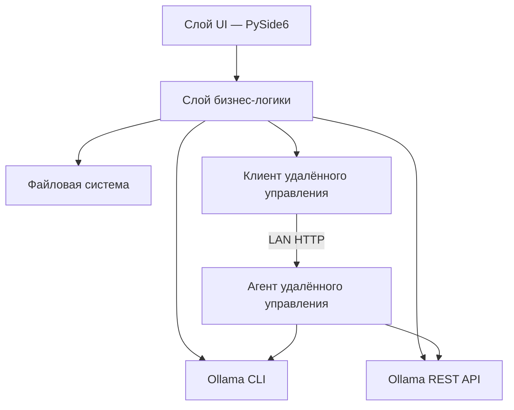
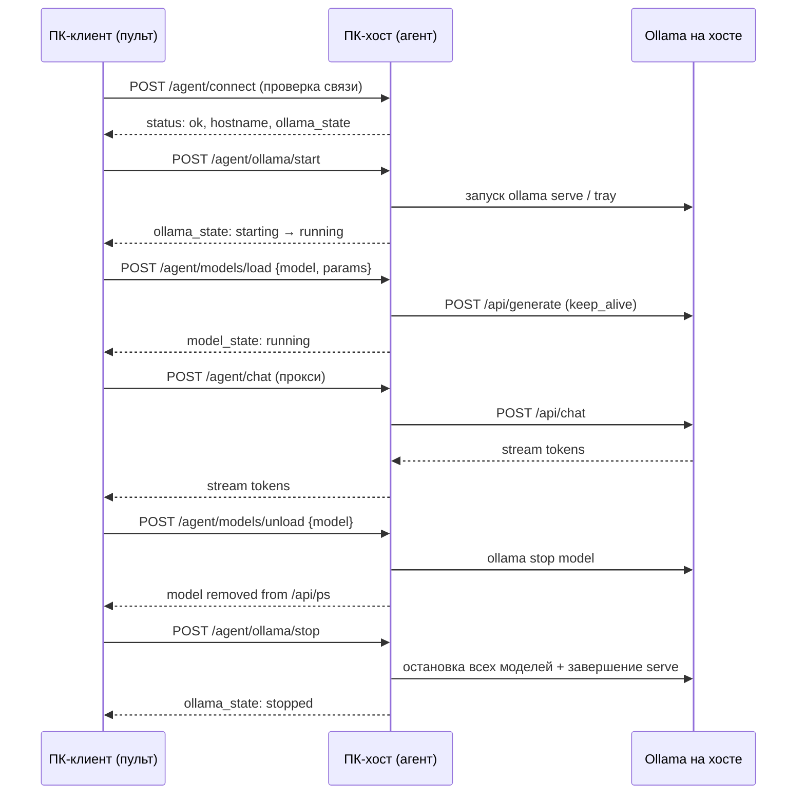

# Техническое задание: Ollama Model Manager

**Версия документа:** 1.1  
**Дата:** 17.06.2025  
**Платформа:** Windows 11  
**Рабочее название проекта:** Ollama Model Manager (рабочее имя, может быть изменено)

---

## 1. Общие сведения

### 1.1. Назначение системы

Десктопное приложение для управления LLM-моделями в экосистеме [Ollama](https://docs.ollama.com/quickstart) на локальном ПК под управлением Windows 11. Программа предоставляет единый графический интерфейс для:

- просмотра установленных (зарегистрированных в Ollama) моделей;
- запуска моделей с доступом по HTTP API в локальной сети и на том же ПК;
- импорта моделей из каталогов Safetensors (Hugging Face) в Ollama;
- экспорта моделей Ollama для переноса на другой ПК;
- удаления моделей из списка Ollama;
- тестирования работы запущенных моделей через встроенный чат;
- **удалённого управления** Ollama на другом ПК в локальной сети: запуск/остановка сервера Ollama, запуск/остановка моделей, индикация состояния и тестовый чат с удалённого рабочего места.

### 1.2. Начальные условия (предпосылки)

На целевом ПК должны быть выполнены следующие условия:

| № | Условие | Примечание |
|---|---------|------------|
| 1 | Установлен Ollama | [Документация Quickstart](https://docs.ollama.com/quickstart) |
| 2 | ОС — Windows 11 | Минимальная целевая платформа |
| 3 | В отдельном каталоге скачаны дистрибутивы моделей с Hugging Face в формате **Safetensors** | Каталог задаётся пользователем при импорте |
| 4 | Скачанные модели Ollama расположены в каталоге, подключённом к Ollama | Через переменную окружения `OLLAMA_MODELS` или стандартный путь `%USERPROFILE%\.ollama\models` |
| 5 | Ollama API доступен по адресу `http://localhost:11434` | Стандартный порт Ollama на Windows |
| 6 | Для удалённого управления: два ПК в одной локальной сети (LAN) с установленным приложением | Один ПК — хост (агент), другой — пульт управления (клиент) |

### 1.3. Целевая аудитория

Пользователи, работающие с локальными LLM-моделями: разработчики, системные администраторы, энтузиасты self-hosted AI. Уровень технической подготовки — от базового (знание путей к каталогам) до продвинутого (настройка параметров Modelfile).

---

## 2. Технологический стек и сборка

### 2.1. Стек разработки

| Компонент | Технология | Версия (рекомендуемая) |
|-----------|------------|------------------------|
| Язык | Python | 3.11+ |
| GUI-фреймворк | PySide6 (Qt for Python) | 6.6+ |
| HTTP-клиент | `httpx` или `requests` | Актуальная стабильная |
| Асинхронность / фоновые задачи | `QThread`, `QRunnable` + сигналы Qt | — |
| Сериализация настроек | JSON / QSettings | — |
| HTTP-сервер агента (удалённое управление) | `FastAPI` + `uvicorn` | Актуальная стабильная |
| WebSocket (опционально) | для push-уведомлений о статусе | — |
| Упаковка | PyInstaller | 6.x |

### 2.2. Сборка в один EXE-файл

- В корне проекта размещается **BAT-файл** `build.bat` (или `build_release.bat`), выполняющий:
  1. создание/активацию виртуального окружения (опционально);
  2. установку зависимостей из `requirements.txt`;
  3. запуск PyInstaller с параметрами `--onefile` (один исполняемый файл);
  4. размещение результата в каталог **`build/`** со всеми необходимыми зависимостями и ресурсами (иконки, QSS-стили, локализация).
- Итоговая структура каталога `build/`:

```
build/
├── OllamaModelManager.exe    # основной исполняемый файл
├── README_build.txt          # краткая инструкция по запуску
└── (при необходимости) дополнительные ресурсы PyInstaller
```

- BAT-файл должен завершаться с понятным сообщением об успехе/ошибке.
- Сборка должна выполняться **на Windows 11** без ручной донастройки после клонирования репозитория (кроме установки Python).

### 2.3. Зависимости от внешних компонентов

- **Ollama CLI** (`ollama`) должен быть доступен в `PATH` системы.
- **Ollama-сервис** должен быть запущен (фоновое приложение в трее Windows или `ollama serve`).
- Приложение **не устанавливает** Ollama — только взаимодействует с ним.

---

## 3. Архитектура приложения

### 3.1. Рекомендуемая структура проекта

```
ollama_model_manager/
├── main.py                     # точка входа
├── ui/
│   ├── main_window.py          # главное окно
│   ├── model_list_widget.py    # список моделей
│   ├── model_details_panel.py  # панель характеристик
│   ├── import_dialog.py        # мастер импорта
│   ├── export_dialog.py        # мастер экспорта
│   ├── progress_dialog.py      # окно хода выполнения
│   ├── chat_widget.py          # тестовый чат
│   ├── settings_dialog.py      # настройки
│   ├── remote_panel.py         # панель удалённого управления
│   └── remote_hosts_dialog.py  # список удалённых хостов
├── core/
│   ├── ollama_client.py        # обёртка над CLI и REST API
│   ├── model_service.py        # бизнес-логика моделей
│   ├── import_service.py       # логика импорта Safetensors / Ollama
│   ├── export_service.py       # логика экспорта
│   ├── config.py               # конфигурация приложения
│   ├── remote/
│   │   ├── agent_server.py     # HTTP-агент на удалённом ПК
│   │   ├── remote_client.py    # клиент удалённого управления
│   │   ├── ollama_process.py   # запуск/остановка процесса Ollama
│   │   └── protocol.py         # контракт API агента
│   └── connection_mode.py      # переключение локальный / агент / клиент
├── resources/
│   ├── styles/
│   │   └── app.qss             # стили интерфейса
│   └── icons/                  # иконки
├── requirements.txt
├── build.bat
└── TZ_servers_ollama.md
```

### 3.2. Слои приложения



### 3.4. Режимы работы приложения

Одно и то же приложение (один EXE) поддерживает три режима. Режим задаётся в настройках и может комбинироваться: **локальный** + **агент** одновременно на хост-ПК.

| Режим | Где включается | Назначение |
|-------|----------------|------------|
| **Локальный** | По умолчанию на любом ПК | Управление Ollama на этом же компьютере |
| **Агент (хост)** | Настройки → «Разрешить удалённое управление» | Приём команд от других ПК в LAN; запуск встроенного HTTP-агента |
| **Клиент (пульт)** | Переключатель «Подключение: Локально / Удалённо» в главном окне | Управление Ollama на выбранном удалённом ПК |

**Сценарий использования (два ПК в LAN):**

1. **ПК-хост** (мощный, с GPU): установлены Ollama и модели. В приложении включён режим **Агент**, заданы порт и (опционально) токен доступа.
2. **ПК-клиент** (рабочая станция): в приложении выбран режим **Удалённое подключение**, указан IP/имя хоста. Пользователь видит список моделей удалённого ПК, запускает/останавливает сервер Ollama и модели, тестирует чат.



### 3.3. Способы взаимодействия с Ollama

| Операция | Предпочтительный способ | Команда / Endpoint |
|----------|--------------------------|-------------------|
| Список моделей | REST API | `GET /api/tags` |
| Детали модели | REST API / CLI | `GET /api/show`, `ollama show <model>` |
| Запущенные модели | REST API | `GET /api/ps` |
| Удаление модели | REST API / CLI | `DELETE /api/delete`, `ollama rm <model>` |
| Создание модели (импорт) | CLI + Modelfile | `ollama create <name> -f Modelfile` |
| Экспорт (копирование blobs) | Файловая система + Modelfile | Копирование из каталога моделей Ollama |
| Запуск модели в памяти | REST API | `POST /api/generate` или `POST /api/chat` |
| Остановка модели | CLI | `ollama stop <model>` |

---

## 4. Функциональные требования

### 4.1. Главное окно — список моделей

#### 4.1.1. Отображение списка

- При запуске и по кнопке «Обновить» приложение получает перечень моделей, зарегистрированных в Ollama (`ollama list` / `GET /api/tags`).
- Для каждой модели в списке отображаются:
  - **имя модели** (например, `llama3.2:latest`);
  - **размер** на диске (в ГБ/МБ, человекочитаемый формат);
  - **дата изменения** (`modified_at`);
  - **семейство / архитектура** (`details.family`, `details.parameter_size`);
  - **уровень квантизации** (`details.quantization_level`);
  - **индикатор состояния**: «остановлена» / «запущена» / «загружается».
- Список поддерживает:
  - сортировку по имени, размеру, дате;
  - текстовый поиск/фильтрацию по имени;
  - выделение одной модели (single selection).

#### 4.1.2. Индикация запущенных моделей

- Периодический опрос `GET /api/ps` (интервал настраивается, по умолчанию 3–5 секунд).
- Запущенные модели визуально выделяются (цветная метка, иконка, бейдж «Running»).
- В панели деталей для запущенной модели отображаются:
  - объём занятой VRAM/RAM (если доступно в ответе API);
  - время работы (uptime, вычисляется локально);
  - параметры контекста (`num_ctx`), если доступны.

### 4.2. Панель деталей и действий над моделью

При выборе модели в списке открывается панель с:

1. **Основными характеристиками** (только чтение):
   - имя, digest, формат (gguf и т.д.);
   - parameter_size, quantization_level;
   - путь к blobs в каталоге моделей Ollama (если определяется);
   - содержимое Modelfile (`ollama show --modelfile <model>`).

2. **Кнопками действий**:
   - **Запустить** — загрузить модель в память и обеспечить доступ по API;
   - **Остановить** — выгрузить модель (`ollama stop`);
   - **Экспортировать** — открыть мастер экспорта;
   - **Удалить** — удалить модель из Ollama с подтверждением;
   - **Тестовый чат** — открыть окно чата для выбранной запущенной модели.

3. **Подробными настройками запуска** (редактируемые перед запуском):
   - `num_ctx` — размер контекстного окна;
   - `temperature` — креативность ответов;
   - `top_p`, `top_k` — параметры сэмплирования;
   - `repeat_penalty` — штраф за повторения;
   - `num_predict` — лимит генерируемых токенов;
   - `seed` — зерно генератора;
   - хост и порт API (по умолчанию `0.0.0.0:11434` для доступа из LAN — см. п. 4.4).

   > Параметры применяются при запуске через создание временного Modelfile или передачу в API-запросы чата.

### 4.3. Экспорт модели Ollama

#### 4.3.1. Назначение

Перенос модели на другой ПК: копирование файлов модели и генерация конфигурационного пакета для подключения на целевой машине.

#### 4.3.2. Алгоритм экспорта

1. Пользователь выбирает модель из списка → «Экспортировать».
2. Указывает **каталог назначения** (по умолчанию — из настроек приложения, п. 4.8).
3. Приложение:
   - получает Modelfile модели (`ollama show --modelfile`);
   - определяет связанные blob-файлы в каталоге моделей Ollama;
   - копирует необходимые файлы в подкаталог `<export_dir>/<model_name>/`;
   - создаёт файл **`ollama_import_config.json`** (или `README_import.md` + `Modelfile`) с инструкцией:
     - имя модели;
     - версия Ollama;
     - пути к скопированным файлам;
     - команда для импорта на другом ПК: `ollama create <name> -f Modelfile`;
     - переменная `OLLAMA_MODELS` для целевого каталога (при необходимости).
4. Отображается **окно хода выполнения** с прогресс-баром (%), текущим этапом и логом.

#### 4.3.3. Структура экспортного пакета

```
<export_dir>/<model_name>/
├── blobs/                      # скопированные blob-файлы
├── Modelfile                   # Modelfile с адаптированными путями
├── manifest.json               # метаданные (имя, digest, размер, дата экспорта)
└── ollama_import_config.json   # инструкция для импорта на другом ПК
```

### 4.4. Запуск модели для доступа по API

#### 4.4.1. Режимы доступа

| Режим | Описание | Адрес |
|-------|----------|-------|
| Локальный | Доступ только с этого ПК | `http://127.0.0.1:11434` |
| Сеть (LAN) | Доступ с других устройств в локальной сети | `http://<IP_ПК>:11434` |

> Для доступа из LAN пользователю может потребоваться установить переменную окружения `OLLAMA_HOST=0.0.0.0:11434` и перезапустить Ollama. Приложение должно **предупреждать** об этом и предлагать инструкцию (без автоматического изменения системных переменных без согласия пользователя).

#### 4.4.2. Процесс запуска

1. Пользователь настраивает параметры запуска (п. 4.2).
2. Нажимает «Запустить».
3. Приложение:
   - проверяет доступность Ollama API;
   - отправляет прогревочный запрос (`POST /api/generate` с `keep_alive`) или использует `ollama run` в фоне;
   - отображает статус «Запущена» в списке;
   - показывает URL для подключения (с кнопкой «Копировать»).
4. Кнопка «Остановить» вызывает `ollama stop <model>`.

### 4.5. Импорт моделей

Поддерживаются **два типа импорта**:

#### 4.5.1. Импорт модели Ollama (из экспортного пакета)

1. Пользователь выбирает «Импорт → Модель Ollama».
2. Указывает **каталог импорта** (каталог с `Modelfile` и `blobs/` из экспортного пакета).
3. Задаёт **имя новой модели** в Ollama.
4. Приложение выполняет `ollama create <name> -f <path>/Modelfile`.
5. Отображается окно прогресса с % (на основе вывода CLI / API `status`, `completed`/`total`).

#### 4.5.2. Импорт модели Safetensors (Hugging Face)

Согласно [документации Ollama — Importing a model from Safetensors weights](https://docs.ollama.com/import#importing-a-model-from-safetensors-weights):

1. Пользователь выбирает «Импорт → Safetensors (Hugging Face)».
2. Указывает **каталог с весами Safetensors** (содержит `.safetensors`, `config.json` и др.).
3. Настраивает параметры импорта (форма с tooltips, п. 4.7):

| Параметр | Обязательность | Описание |
|----------|----------------|----------|
| Имя модели в Ollama | Да | Имя для `ollama create` |
| Тип импорта | Да | «Полная модель» / «Адаптер (LoRA)» |
| Базовая модель (`FROM`) | Для адаптера | Имя существующей модели Ollama или путь к базовой Safetensors |
| Путь к Safetensors | Да | Абсолютный путь к каталогу весов |
| Квантизация (`--quantize`) | Нет | `q8_0`, `q4_K_S`, `q4_K_M` или без квантизации |
| SYSTEM prompt | Нет | Системное сообщение в Modelfile |
| PARAMETER (num_ctx, temperature и др.) | Нет | Параметры Modelfile |
| TEMPLATE | Нет | Шаблон промпта (для продвинутых пользователей) |
| LICENSE | Нет | Текст лицензии |

4. Приложение **генерирует Modelfile** автоматически:

   **Полная модель:**
   ```dockerfile
   FROM /absolute/path/to/safetensors/directory
   PARAMETER num_ctx 4096
   SYSTEM """..."""
   ```

   **Адаптер:**
   ```dockerfile
   FROM <base_model_name>
   ADAPTER /absolute/path/to/safetensors/adapter/directory
   ```

5. Выполняется `ollama create <name> -f Modelfile` (с `--quantize` при необходимости).
6. Отображается окно прогресса.

**Поддерживаемые архитектуры** (согласно документации Ollama): Llama 2/3/3.1/3.2, Mistral/Mixtral, Gemma 1/2, Phi3.

При выборе неподдерживаемой архитектуры (определяется по `config.json`) — предупреждение до начала импорта.

### 4.6. Удаление модели

1. Пользователь выбирает модель → «Удалить».
2. Диалог подтверждения с указанием имени и размера модели.
3. Выполняется `ollama rm <model>` или `DELETE /api/delete`.
4. Список обновляется.
5. Если модель запущена — предварительная остановка с предупреждением.

### 4.7. Tooltips для параметров

Для **всех** настраиваемых полей (запуск, импорт, экспорт, настройки, чат) реализуются всплывающие подсказки (QToolTip) со структурой:

```
[Название параметра]
Что это: краткое описание.
За что отвечает: влияние на поведение модели.
Где используется: Modelfile / API / CLI.
Рекомендации: типичные значения и предостережения.
```

**Пример для `num_ctx`:**

> **num_ctx (размер контекста)**  
> Что это: максимальное количество токенов, которые модель учитывает при генерации.  
> За что отвечает: объём «памяти» диалога; большие значения требуют больше RAM/VRAM.  
> Где используется: Modelfile (`PARAMETER num_ctx`), API `/api/chat`.  
> Рекомендации: 2048–4096 для большинства задач; 8192+ при наличии достаточной памяти.

Полный перечень параметров с tooltips — в **Приложении А**.

### 4.8. Настройки приложения

Окно «Настройки» (меню или кнопка ⚙):

| Параметр | Тип | Обязательность | Описание |
|----------|-----|----------------|----------|
| Каталог моделей Ollama | Абсолютный путь | Да | Путь к каталогу, где Ollama хранит модели (`OLLAMA_MODELS` или `%USERPROFILE%\.ollama\models`) |
| Каталог экспорта по умолчанию | Абсолютный путь | Да | Куда сохранять экспортные пакеты |
| URL Ollama API | Строка | Да | По умолчанию `http://localhost:11434` |
| Интервал опроса статуса | Число (сек) | Нет | По умолчанию 5 |
| Тема оформления | Выбор | Нет | Светлая / Тёмная |
| Язык интерфейса | Выбор | Нет | Русский (основной) |

**Вкладка «Удалённое управление»** — параметры из п. 4.11.7 (агент и клиент).

> **Каталоги импорта** (Safetensors, экспортный пакет Ollama) **не** хранятся в настройках — вводятся пользователем при каждой процедуре импорта через диалог выбора каталога.

Настройки сохраняются в файл конфигурации рядом с EXE или в `%APPDATA%/OllamaModelManager/config.json`.

**Автосохранение размеров и положения главного окна** при изменении/закрытии.

### 4.9. Окно хода выполнения (прогресс)

Универсальный диалог для операций импорта и экспорта:

- **Прогресс-бар** с процентом выполнения (0–100%);
- **Текущий этап** (текст): «Копирование blob-файлов…», «Создание Modelfile…», «Выполнение ollama create…»;
- **Лог-область** (прокручиваемый текст, моноширинный шрифт);
- Кнопки: «Отмена» (если операция прерываема), «Закрыть» (после завершения);
- При ошибке — выделение красным, текст ошибки, рекомендации по устранению.

Источники данных для прогресса:
- для `ollama create` — парсинг stdout / NDJSON API (`completed`, `total`, `status`);
- для копирования файлов — отношение скопированных байт к общему объёму.

### 4.10. Тестовый чат

Встроенное окно для проверки работы запущенной модели через Ollama API.

#### Функции чата

- Выбор модели (только из запущенных или с автозапуском при открытии чата);
- Область истории сообщений (user / assistant);
- Поле ввода с поддержкой многострочного текста;
- Кнопки: «Отправить», «Очистить историю», «Остановить генерацию»;
- Индикатор «модель печатает…» при стриминге;
- Настройки чата (сворачиваемая панель):
  - `temperature`, `top_p`, `top_k`;
  - system prompt;
  - streaming on/off;
  - отображение токенов/времени ответа (если API возвращает).

#### API

- Основной endpoint: `POST /api/chat` ([документация](https://docs.ollama.com/api/chat));
- Поддержка streaming (`"stream": true`) с построчным обновлением UI.
- В режиме **удалённого подключения** чат работает через прокси агента (`POST /agent/chat`) или напрямую к Ollama API удалённого хоста (`http://<IP>:11434/api/chat`), если сервер Ollama уже запущен и доступен из LAN.

### 4.11. Удалённое управление по локальной сети (LAN)

#### 4.11.1. Назначение

Обеспечить управление Ollama на **удалённом ПК** с **локального ПК** в пределах одной локальной сети без ручного подключения по RDP/SSH. Пользователь запускает одно и то же приложение на двух компьютерах; с ПК-клиента выполняет:

- проверку связи с удалённым хостом;
- **запуск и остановку сервера Ollama** на удалённом ПК;
- просмотр списка моделей, установленных на удалённом ПК;
- **запуск выбранной модели** в память удалённого Ollama;
- **остановку (выгрузку) модели** из памяти с удалением из списка запущенных (`ollama stop` / `GET /api/ps`);
- **индикацию** состояния сервера Ollama и каждой модели (остановлен / запускается / запущен / ошибка);
- **тестовый чат** с моделью, работающей на удалённом ПК.

> Импорт, экспорт и удаление моделей с диска в удалённом режиме **не обязательны** в первой версии; допускается ограничение только операциями запуска/остановки сервера, моделей и чата. При необходимости — расширение в следующих версиях.

#### 4.11.2. Встроенный агент на ПК-хосте

На удалённом ПК при включении режима «Агент» приложение поднимает **встроенный HTTP-сервер** (порт по умолчанию **11435**, настраивается).

**Функции агента:**

| Функция | Описание |
|---------|----------|
| Проверка связи | `GET /agent/health` — версия приложения, имя ПК, состояние Ollama |
| Запуск Ollama | Запуск фонового процесса Ollama (`ollama serve`) или активация уже установленного tray-приложения |
| Остановка Ollama | Выгрузка всех моделей из памяти, остановка процесса `ollama serve` / выход из tray-приложения |
| Список моделей | Прокси `GET /api/tags` с удалённого Ollama |
| Запущенные модели | Прокси `GET /api/ps` |
| Загрузка модели | Запуск модели с параметрами (`num_ctx`, `temperature` и др.) |
| Выгрузка модели | `ollama stop <model>` — модель исчезает из списка запущенных |
| Детали модели | Прокси `POST /api/show` |
| Тестовый чат | Прокси `POST /api/chat` со streaming |
| Подписка на статус | `GET /agent/events` (SSE или WebSocket) — push при смене состояния Ollama/моделей |

**Запуск Ollama на удалённом ПК (алгоритм агента):**

1. Проверить, не запущен ли уже Ollama (`GET http://127.0.0.1:11434/api/version` или аналог).
2. Если не запущен — выполнить `ollama serve` в фоновом процессе с `OLLAMA_HOST=0.0.0.0:11434` (для доступа из LAN к Ollama API, если требуется прямое подключение).
3. Ожидать готовности API (polling с таймаутом, напр. 30 сек).
4. Вернуть клиенту состояние: `stopped` → `starting` → `running` или `error`.

**Остановка Ollama на удалённом ПК (алгоритм агента):**

1. Получить список запущенных моделей (`GET /api/ps`).
2. Для каждой модели выполнить `ollama stop <model>`.
3. Завершить процесс Ollama serve / отправить команду выхода tray-приложению (платформенно-зависимо, Windows: `taskkill` по имени процесса `ollama` с подтверждением в логе).
4. Убедиться, что `/api/ps` пуст и API недоступен.
5. Вернуть клиенту состояние: `running` → `stopping` → `stopped`.

#### 4.11.3. Клиент удалённого управления (ПК-пульт)

В главном окне — переключатель **«Подключение: Локально | Удалённо»**.

При выборе «Удалённо»:

- отображается выпадающий список сохранённых удалённых хостов (имя, IP, порт);
- кнопки **«Подключиться»** / **«Отключиться»**;
- индикатор связи: ● Подключено / ○ Нет связи / ⟳ Подключение…;
- весь UI списка моделей и панели действий работает в **контексте удалённого хоста** (те же кнопки «Запустить сервер Ollama», «Остановить сервер», «Запустить модель», «Остановить модель», «Тестовый чат»).

**Индикация на клиенте (обязательная):**

| Объект | Состояния | Визуализация |
|--------|-----------|--------------|
| Связь с агентом | нет / есть / ошибка | Цветной индикатор в статус-баре + текст |
| Сервер Ollama на хосте | остановлен / запускается / работает / останавливается / ошибка | Бейдж в шапке панели + кнопки «Запустить/Остановить сервер» |
| Модель | остановлена / загружается / запущена | Иконка в списке моделей (как в п. 4.1.2) |
| Операция в процессе | — | Спиннер + блокировка повторного нажатия до завершения |

Опрос статуса: комбинация периодического polling (`GET /agent/status`) и push-событий (`/agent/events`), интервал polling — из настроек (по умолчанию 3 сек).

#### 4.11.4. Управление сервером Ollama на удалённом ПК

В панели удалённого хоста (над списком моделей) — отдельная группа **«Сервер Ollama»**:

| Элемент | Действие |
|---------|----------|
| Индикатор состояния | Текущий статус: «Остановлен», «Запускается…», «Работает», «Останавливается…» |
| Кнопка «Запустить сервер Ollama» | Доступна, если Ollama остановлен; запускает serve на удалённом ПК |
| Кнопка «Остановить сервер Ollama» | Доступна, если Ollama работает; выгружает все модели и останавливает процесс |
| URL API | Отображение `http://<IP_хоста>:11434` с кнопкой «Копировать» (после запуска) |
| Версия Ollama | Отображается после успешного запуска |

Диалог подтверждения при остановке сервера: «Будут выгружены все запущенные модели. Продолжить?»

#### 4.11.5. Удалённый запуск и остановка модели

Логика идентична п. 4.2 и 4.4, но команды отправляются агенту:

1. **Запуск модели:** клиент → `POST /agent/models/load` с телом `{ "model": "llama3.2", "options": { "num_ctx": 4096, ... } }` → агент прогревает модель → статус «Запущена» в списке.
2. **Остановка модели:** клиент → `POST /agent/models/unload` с `{ "model": "llama3.2" }` → агент вызывает `ollama stop` → модель **исчезает из списка запущенных** (`/api/ps`), в списке установленных моделей остаётся со статусом «остановлена».

Окно прогресса при загрузке модели (особенно больших): этап «Ожидание ответа Ollama…», таймаут с понятным сообщением.

#### 4.11.6. Удалённый тестовый чат

- Открывается той же кнопкой «Тестовый чат»; в заголовке окна — метка **«Удалённо: &lt;имя хоста&gt;»**.
- Если сервер Ollama на хосте не запущен — предложение запустить сервер и модель.
- Streaming ответов через прокси агента.
- При обрыве связи — сообщение в чате и кнопка «Переподключиться».

#### 4.11.7. Настройки удалённого подключения

Добавляются в окно «Настройки» (вкладки **«Локально»** и **«Удалённое управление»**).

**Вкладка «Агент (этот ПК — хост)»:**

| Параметр | Тип | По умолчанию | Описание |
|----------|-----|--------------|----------|
| Разрешить удалённое управление | bool | false | Включает HTTP-агент при старте приложения |
| Порт агента | int | 11435 | Порт встроенного сервера агента |
| Слушать на всех интерфейсах | bool | true | `0.0.0.0` — доступ из LAN; `127.0.0.1` — только локально |
| Токен доступа | строка | пусто | Опциональный Bearer-токен; если задан — обязателен для всех запросов клиента |
| Автозапуск агента | bool | true | Запускать агент вместе с приложением (если разрешено удалённое управление) |
| Разрешить удалённую остановку Ollama | bool | true | Разрешить клиентам останавливать сервер Ollama на этом ПК |
| Показывать уведомление при подключении клиента | bool | true | Toast/системное уведомление Windows |

**Вкладка «Клиент (подключение к хостам)»:**

| Параметр | Тип | Описание |
|----------|-----|----------|
| Список удалённых хостов | таблица | Имя (произвольное), IP или hostname, порт агента, токен (опционально), таймаут (сек) |
| Хост по умолчанию | выбор из списка | Автовыбор при переключении в режим «Удалённо» |
| Таймаут подключения | int | По умолчанию 10 сек |
| Таймаут операций | int | По умолчанию 120 сек (загрузка модели) |
| Интервал опроса статуса | int | По умолчанию 3 сек |

Кнопки: **«Добавить хост»**, **«Изменить»**, **«Удалить»**, **«Проверить связь»** (тестовый запрос `GET /agent/health`).

**Пример записи хоста в `config.json`:**

```json
{
  "remote_hosts": [
    {
      "id": "gpu-pc-1",
      "display_name": "ПК с GPU (офис)",
      "host": "192.168.1.50",
      "agent_port": 11435,
      "auth_token": "optional-secret-token",
      "timeout_sec": 10
    }
  ]
}
```

#### 4.11.8. Безопасность удалённого доступа

- Работа **только в локальной сети** (LAN); не предназначено для доступа из интернета без VPN.
- Рекомендация задать **токен доступа** на агенте; передача в заголовке `Authorization: Bearer <token>`.
- При первом включении агента — предупреждение о рисках удалённого управления и необходимости настроить брандмауэр Windows (разрешить входящие на порт агента только для частной сети).
- Логирование всех удалённых подключений и команд в `app.log` на хосте (время, IP клиента, операция).
- Не хранить токены в открытом виде в логах.

#### 4.11.9. Обработка ошибок (удалённый режим)

| Ситуация | Поведение |
|----------|-----------|
| Агент недоступен | «Не удалось подключиться к &lt;host&gt;»; кнопка «Повторить» |
| Неверный токен | «Ошибка авторизации» |
| Ollama на хосте не запускается | Детальная ошибка из лога агента; статус «Ошибка запуска» |
| Модель не найдена на хосте | Обновить список моделей; сообщение пользователю |
| Обрыв связи во время операции | Откат UI; предложение переподключиться |
| Брандмауэр блокирует порт | Инструкция по добавлению правила для `OllamaModelManager.exe` |

---

## 5. Требования к интерфейсу (UI/UX)

### 5.1. Общие принципы

- Современный, **стильный и аккуратный** интерфейс в духе нативных Windows 11-приложений.
- Тёмная и светлая тема (переключение в настройках).
- Адаптивная вёрстка: минимальный размер окна 1024×700 px.
- Использование QSS (Qt Style Sheets) для кастомизации.
- Иконки — SVG или PNG с поддержкой DPI scaling.
- Все длительные операции — в фоновых потоках, UI не блокируется.
- Понятные сообщения об ошибках на русском языке.

### 5.2. Макет главного окна

```
┌──────────────────────────────────────────────────────────────────────────┐
│  Ollama Model Manager    [Локально ▼|Удалённо: ПК с GPU ▼] [Подключиться] │
│                          [Импорт ▼] [Обновить] [⚙ Настройки]             │
├──────────────────┬───────────────────────────────────────────────────────┤
│  🔍 Поиск...     │  ┌─ Сервер Ollama (удалённо) ─────────────────────┐  │
│                  │  │ ● Работает  http://192.168.1.50:11434  [Копир.] │  │
│  ● llama3.2      │  │ [Остановить сервер]  [Запустить сервер]         │  │
│    gemma2        │  └─────────────────────────────────────────────────┘  │
│    mistral       │  Детали модели: llama3.2:latest                       │
│                  │  Статус: ● Запущена (удалённо)                       │
│                  │  [Запустить] [Остановить] [Тестовый чат]             │
│                  │  ▼ Настройки запуска ...                             │
├──────────────────┴───────────────────────────────────────────────────────┤
│  ● Подключено к 192.168.1.50 | Ollama: работает | 1 модель запущена      │
└──────────────────────────────────────────────────────────────────────────┘
```

### 5.3. Состояния элементов

- Кнопки «Остановить», «Тестовый чат» активны только для запущенных моделей.
- Кнопка «Удалить» неактивна во время импорта/экспорта этой модели.
- Визуальная индикация недоступности Ollama (красный статус-бар, подсказка «Запустите Ollama»).
- В удалённом режиме кнопки импорта/экспорта/удаления могут быть скрыты или неактивны (если не реализованы для удалённого хоста).
- Переключатель «Локально / Удалённо» всегда виден в шапке главного окна.

---

## 6. Нефункциональные требования

### 6.1. Производительность

- Загрузка списка моделей — не более 3 секунд при 50 моделях.
- UI остаётся отзывчивым при копировании файлов > 10 ГБ (прогресс в фоне).

### 6.2. Надёжность

- Корректная обработка ситуаций: Ollama не запущен, модель не найдена, недостаточно места на диске, прерванная операция.
- Логирование операций в файл `%APPDATA%/OllamaModelManager/app.log`.

### 6.3. Безопасность

- Приложение не хранит пароли и не передаёт данные во внешние сервисы.
- Предупреждение при включении доступа из LAN о рисках открытого API без аутентификации.
- Удалённый агент: опциональная Bearer-авторизация, логирование подключений, рекомендации по брандмауэру Windows (только частная сеть).

### 6.4. Совместимость

- Windows 11 (основная), Windows 10 22H2+ (желательная совместимость).
- Ollama актуальной версии на момент разработки.

---

## 7. Обработка ошибок

| Ситуация | Поведение приложения |
|----------|---------------------|
| Ollama не запущен | Сообщение + ссылка на документацию; кнопка «Повторить» |
| Модель не найдена при операции | Диалог с ошибкой, обновление списка |
| Ошибка `ollama create` | Показ stderr в окне прогресса |
| Каталог не существует | Валидация до начала операции |
| Недостаточно места | Проверка свободного места перед экспортом/импортом |
| Модель запущена при удалении | Предложение остановить и повторить |
| Удалённый агент недоступен | Сообщение, проверка IP/порта/брандмауэра |
| Ошибка авторизации на агенте | Проверка токена в настройках хоста |
| Таймаут загрузки модели на хосте | Статус «Ошибка», лог агента |

---

## 8. Этапы разработки

### Этап 1. Каркас приложения
- Структура проекта, главное окно, настройки, конфигурация.
- Интеграция с `GET /api/tags`, отображение списка моделей.

### Этап 2. Управление моделями
- Запуск/остановка, индикация `GET /api/ps`.
- Удаление моделей.
- Панель деталей с характеристиками.

### Этап 3. Импорт
- Импорт Safetensors (генерация Modelfile, `ollama create`).
- Импорт пакета Ollama.
- Окно прогресса.

### Этап 4. Экспорт
- Копирование blobs, генерация пакета и `ollama_import_config.json`.
- Окно прогресса.

### Этап 5. Тестовый чат
- UI чата, streaming API, настройки чата.

### Этап 6. Удалённое управление (LAN)
- HTTP-агент на хост-ПК, клиент на пульт-ПК.
- Запуск/остановка сервера Ollama и моделей удалённо.
- Индикация состояния, удалённый тестовый чат.
- Настройки подключения, токен, список хостов.

### Этап 7. Полировка UI и сборка
- Темы, tooltips, QSS-стили.
- `build.bat`, PyInstaller, тестирование на Windows 11.

---

## 9. Критерии приёмки

1. Приложение собирается в один EXE через `build.bat` в каталог `build/`.
2. Отображается актуальный список моделей Ollama с характеристиками.
3. Запущенные модели визуально индицируются и обновляются автоматически.
4. Экспорт модели создаёт переносимый пакет с файлом настройки для другого ПК.
5. Импорт Safetensors успешно создаёт модель в Ollama для поддерживаемых архитектур.
6. Импорт экспортного пакета Ollama восстанавливает модель на другом ПК.
7. Удаление модели работает с подтверждением.
8. Тестовый чат отправляет сообщения и получает ответы от запущенной модели.
9. Все параметры настроек, импорта и запуска имеют tooltips по заданному формату.
10. Операции импорта/экспорта показывают прогресс в процентах.
11. В настройках задаются абсолютные пути к каталогу моделей Ollama и каталогу экспорта.
12. Размеры главного окна сохраняются между сеансами.
13. С двух ПК в LAN: на хосте включён агент, с клиента выполняется подключение по IP/порту.
14. С клиента можно запустить и остановить сервер Ollama на удалённом ПК с индикацией состояния.
15. С клиента можно запустить и остановить (выгрузить) модель на удалённом ПК; модель исчезает из списка запущенных после остановки.
16. Удалённый тестовый чат отправляет сообщения и получает streaming-ответы от модели на хосте.
17. Настройки удалённого подключения (хост, порт, токен) сохраняются и работают после перезапуска приложения.

---

## Приложение А. Справочник параметров с tooltips

### Параметры Modelfile / запуска

| Параметр | Tooltip |
|----------|---------|
| `num_ctx` | Размер контекстного окна в токенах. Определяет, сколько текста модель «помнит». Больше — лучше для длинных диалогов, но выше потребление RAM/VRAM. Рекомендуется: 2048–8192. |
| `temperature` | Температура сэмплирования (0.0–2.0). Выше — креативнее и разнообразнее ответы; ниже — точнее и предсказуемее. Рекомендуется: 0.7 для чата, 0.1–0.3 для кода. |
| `top_p` | Nucleus sampling (0.0–1.0). Ограничивает выбор токенов по суммарной вероятности. Работает совместно с top_k. Рекомендуется: 0.9. |
| `top_k` | Количество топ-кандидатов при выборе следующего токена. Меньше — консервативнее. Рекомендуется: 40. |
| `repeat_penalty` | Штраф за повторение токенов (1.0 = нет штрафа). Выше 1.0 уменьшает зацикливание. Рекомендуется: 1.1. |
| `num_predict` | Максимум токенов в ответе (-1 = без лимита). Ограничивает длину генерации. |
| `seed` | Зерно ГПСЧ для воспроизводимости. Одинаковый seed + prompt = одинаковый ответ. 0 = случайный. |
| `stop` | Стоп-последовательность. При появлении в выводе генерация прекращается. |
| `quantize` | Уровень квантизации при импорте (`q4_K_M`, `q8_0` и др.). Меньший размер и RAM, возможна потеря качества. |

### Параметры импорта Safetensors

| Параметр | Tooltip |
|----------|---------|
| Имя модели | Уникальное имя в Ollama для вызова через `ollama run <имя>` и API. Используйте латиницу, без пробелов. |
| Тип импорта | «Полная модель» — веса foundation model. «Адаптер» — LoRA/QLoRA поверх базовой модели. |
| Базовая модель | Для адаптера: имя модели Ollama или путь к Safetensors базы. Должна совпадать с моделью, на которой обучался адаптер. |
| Путь Safetensors | Абсолютный путь к каталогу с файлами `.safetensors` и `config.json`. |
| SYSTEM | Системный промпт, задающий роль и поведение ассистента по умолчанию. |
| TEMPLATE | Шаблон промпта в формате Go template. Менять только при знании формата конкретной модели. |

### Параметры настроек приложения

| Параметр | Tooltip |
|----------|---------|
| Каталог моделей Ollama | Абсолютный путь к хранилищу моделей. Соответствует `OLLAMA_MODELS` или `%USERPROFILE%\.ollama\models`. Используется для экспорта blobs. |
| Каталог экспорта | Каталог по умолчанию для экспортных пакетов. Можно изменить при каждом экспорте. |
| URL Ollama API | Адрес HTTP API Ollama. По умолчанию `http://localhost:11434`. |

### Параметры удалённого управления

| Параметр | Tooltip |
|----------|---------|
| Разрешить удалённое управление | Включает встроенный HTTP-агент на этом ПК. Другие компьютеры в LAN смогут управлять Ollama. Рекомендуется задать токен доступа. |
| Порт агента | TCP-порт для приёма команд удалённого управления (по умолчанию 11435). Не должен совпадать с портом Ollama (11434). |
| Токен доступа | Секретная строка для авторизации клиентов. Передаётся в заголовке Authorization. Пустое значение — без авторизации (не рекомендуется). |
| IP / hostname хоста | Сетевой адрес удалённого ПК в LAN (например, 192.168.1.50 или gpu-pc.local). |
| Таймаут подключения | Максимальное время ожидания ответа агента при установке связи (сек). |
| Разрешить удалённую остановку Ollama | Если выключено, клиенты не смогут останавливать сервер Ollama на этом ПК, только управлять моделями. |

---

## Приложение Б. Ссылки на документацию

- [Ollama Quickstart](https://docs.ollama.com/quickstart)
- [Импорт моделей (Safetensors, GGUF)](https://docs.ollama.com/import)
- [Справочник Modelfile](https://docs.ollama.com/modelfile)
- [Ollama API](https://docs.ollama.com/api/introduction)
- [Ollama на Windows](https://docs.ollama.com/windows)
- [CLI Reference](https://docs.ollama.com/cli)

---

## Приложение В. Пример `ollama_import_config.json`

```json
{
  "format_version": "1.0",
  "model_name": "my-custom-model",
  "exported_at": "2025-06-17T12:00:00Z",
  "source_ollama_version": "0.5.0",
  "size_bytes": 4734627840,
  "digest": "sha256:abc123...",
  "files": [
    "blobs/sha256-...",
    "Modelfile"
  ],
  "import_instructions": {
    "step_1": "Скопируйте папку на целевой ПК",
    "step_2": "Убедитесь, что Ollama установлен и запущен",
    "step_3": "Выполните: ollama create my-custom-model -f Modelfile",
    "step_4": "Проверьте: ollama run my-custom-model"
  },
  "ollama_models_env": "При необходимости задайте OLLAMA_MODELS на целевом ПК"
}
```

---

## Приложение Г. API встроенного агента (черновик контракта)

Базовый URL: `http://<host>:<agent_port>/agent`

Все запросы (кроме `/health` при отключённой авторизации) могут требовать заголовок:
`Authorization: Bearer <token>`

### Endpoints

| Метод | Путь | Описание | Тело запроса | Ответ |
|-------|------|----------|--------------|-------|
| GET | `/health` | Проверка связи | — | `{ "status": "ok", "app_version": "...", "hostname": "...", "ollama_state": "stopped\|starting\|running\|stopping" }` |
| GET | `/status` | Полный статус хоста | — | `{ "ollama_state", "ollama_version", "ollama_api_url", "running_models": [...] }` |
| POST | `/ollama/start` | Запуск сервера Ollama | `{ "bind_host": "0.0.0.0", "port": 11434 }` | `{ "ollama_state": "starting" }` → polling до `running` |
| POST | `/ollama/stop` | Остановка сервера Ollama | — | `{ "ollama_state": "stopping" }` → `stopped` |
| GET | `/models` | Список моделей | — | Прокси ответа `GET /api/tags` |
| GET | `/models/running` | Запущенные модели | — | Прокси ответа `GET /api/ps` |
| POST | `/models/load` | Загрузить модель в память | `{ "model": "name", "options": { "num_ctx": 4096, ... } }` | `{ "status": "loading\|running\|error", "message": "..." }` |
| POST | `/models/unload` | Выгрузить модель | `{ "model": "name" }` | `{ "status": "unloaded" }` |
| POST | `/models/show` | Детали модели | `{ "model": "name" }` | Прокси `POST /api/show` |
| POST | `/chat` | Тестовый чат (прокси) | Тело как `POST /api/chat` Ollama | NDJSON stream |
| GET | `/events` | SSE: события статуса | — | `event: ollama_state`, `event: model_state` |

### Пример: запуск модели с клиента

```http
POST http://192.168.1.50:11435/agent/models/load
Authorization: Bearer my-secret-token
Content-Type: application/json

{
  "model": "llama3.2:latest",
  "options": {
    "num_ctx": 4096,
    "temperature": 0.7
  }
}
```

### Пример: остановка сервера Ollama

```http
POST http://192.168.1.50:11435/agent/ollama/stop
Authorization: Bearer my-secret-token
```

Ответ после завершения:

```json
{
  "ollama_state": "stopped",
  "running_models": []
}
```

---

*Конец документа*
